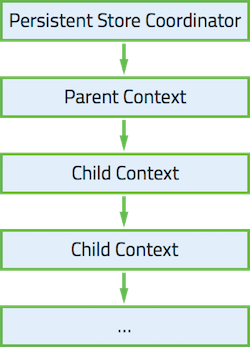

#CoreDataConcurrency

##Background
This project implements the [proven](http://floriankugler.com/2013/04/29/concurrent-core-data-stack-performance-shootout/) best Core Data Stack structure which combines independent managed objects contexts with different concurrency types. 

There are many different ways to configure the Code Data Stack. Many reowned developers (or even Apple) suggest using [nested context feature](http://developer.apple.com/library/ios/releasenotes/DataManagement/RN-CoreData/index.html#//apple_ref/doc/uid/TP40010637-CH1-SW1) where you can specify a parent managed object context by using `setParentContext:` and assigning different concurrency types.

Regardless of the concurrency type of the parent context and its children, a nested Stack will look like:

    

Whereas an independent managed object contexts looks like:

    

In order to propagate changes between the contexts, we take advantage of [NSManagedObjectContextDidSaveNotification](https://developer.apple.com/library/mac/documentation/Cocoa/Reference/CoreDataFramework/Classes/NSManagedObjectContext_Class/index.html#//apple_ref/c/data/NSManagedObjectContextDidSaveNotification) where we will be listening to changes in the context and we will merge changes by calling [mergeChangesFromContextDidSaveNotification:](https://developer.apple.com/library/mac/documentation/Cocoa/Reference/CoreDataFramework/Classes/NSManagedObjectContext_Class/index.html#//apple_ref/occ/instm/NSManagedObjectContext/mergeChangesFromContextDidSaveNotification:) on the other context. 
